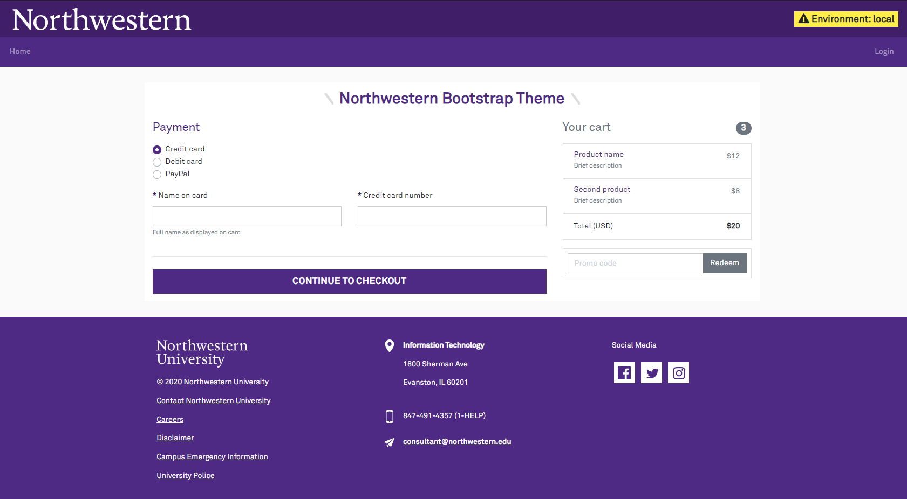

# Northwestern Bootstrap Preset for Laravel
Adds a Northwestern Bootstrap theme into your Laravel application.

The Sentry browser SDK (for reporting on JS errors) will be automatically configured if you are using Sentry in the Laravel app.

This depends on the `laravel/ui` package. It is mutually exclusive with Laravel Breeze/Jetstream, as those no longer use Bootstrap.

## Overview
The package modifies the default Bootstrap settings to be more purple, loads the Northwestern fonts, adds [Font Awesome icons](https://fontawesome.com/icons?d=gallery&m=free), and gives you a responsive ready-made site layout.



For the most part, the purple-ization is rolled out across all Bootstrap components and you will not need to do anything special to take advantage of it.

In order to use this package, you must:

- Be on Laravel 7+
- Use Yarn to manage your JS/CSS dependencies
- Use [Laravel Mix](https://laravel.com/docs/7.x/mix) to bundle your assets

## Installation
Install the package via composer, and then swap to the Northwestern preset. This works like the [standard Laravel UI presets](https://laravel.com/docs/7.x/frontend).

:::danger Overwrites Files
Changing your UI preset will overwrite some files in `resources/scss`, `resources/views`, and `resources/js`. 

If you are adding this to an existing app, make sure you have a backup of your project before changing the preset.
:::

The installation process is:

```sh
composer require northwestern-sysdev/northwestern-laravel-ui
php artisan vendor:publish --provider="Northwestern\SysDev\UI\Providers\NorthwesternUiServiceProvider"

php artisan ui northwestern # you can add --auth if you need the register/login stuff
```

You should review the `config/northwestern-theme.php` config file and adjust the default values. Alternatively, you may set them all as environment variables:

```bash
# Lockup image used in the header
# Should be either a full URL (http://...) or a file in your public folder (images/lockup.png)
NU_THEME_LOCKUP=https://common.northwestern.edu/v8/css/images/northwestern.svg

# Office & contact info used in the footer
NU_THEME_OFFICE_NAME=Information Technology
NU_THEME_OFFICE_ADDR=1800 Sherman Ave
NU_THEME_OFFICE_CITY=Evanston, IL 60201
NU_THEME_OFFICE_PHONE=(777) 777-777
NU_THEME_OFFICE_EMAIL=foo@example.org

# If you are using Sentry, specifying the DSN with the same environment variable
# will initialize the browser SDK to capture client-side JS errors.
#
# This is NOT required and can be ignored if you do not use Sentry.
SENTRY_LARAVEL_DSN=
```

The `resources/views/layout/_nav.blade.php` view will be created in your project. This is intended for you to customize with nav items, login links, and user info.

### Verifying the Installation
The package has a built-in demo view to showcase the layout & theme. The easiest way to see it is to add an entry to your `routes/web.php` file:

```php
Route::get('/demo', function () {
    return view('northwestern::demo-styles');
});
```

## Upgrading
### v1.6.0
This release fixes accessibility concerns

There are no breaking changes in this release.

To get these changes on existing apps add the following to the `sass/nu_purple_layout.scss` in your app.

```css
//This overrides bootstrap default [color: hsla(0,0%,100%,.5);] for accessibility reasons
.navbar-dark .navbar-nav .nav-link {
    color: hsla(0,0%,100%,.6);
}
```

### v1.5.0
This release adds support for modifying the body tag.

There are no breaking changes.

### v1.4.0
This release supports Laravel 8.

There are no breaking changes in this release.

:::tip Laravel 8 Paginator
The framework changed the paginator to use TailwindCSS styles in Laravel 8.

If you are seeing very large angle brackets beneath your paginator, you need to [add `Paginator::useBootstrap()`](https://laravel.com/docs/8.x/upgrade#pagination-defaults) to your `AppServiceProvider`.
:::
