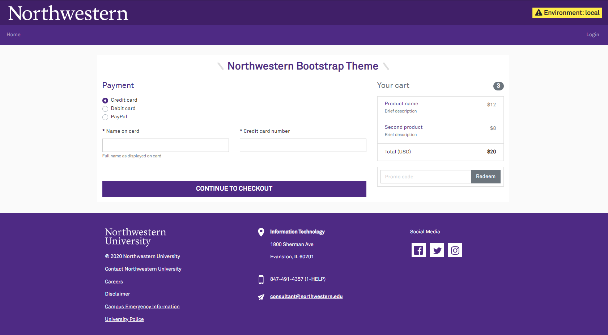
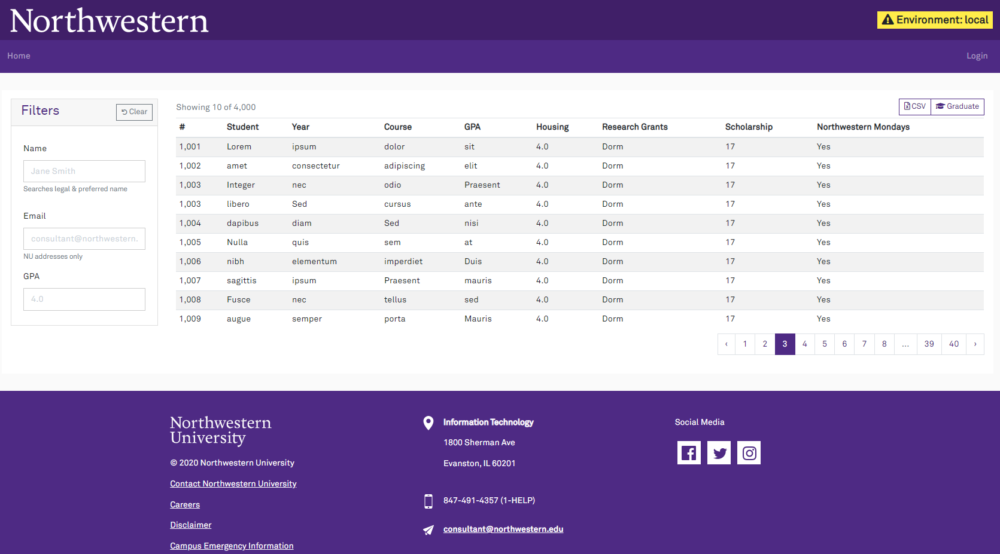
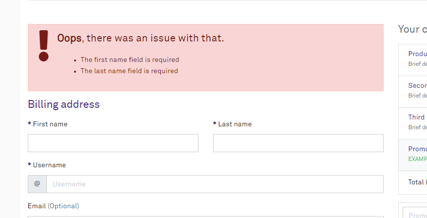

# Using the Layouts
There are two different versions of the layout: 

- **Purple Container** - the site content is wrapped in a run-of-the-mill Bootstrap container, which is sized based on media query breakpoints
- **Purple Widescreen** - your content has access to (nearly) the full width of the page, with a slot for a sidebar

The header, footer, flash messaging, and other features are consistent between the two layouts.

## Purple Container
The purple container is a bread-and-butter general purpose layout.

```php
@extends('northwestern::purple-container')

@section('heading')
<h2>Northwestern Bootstrap Theme</h2>
@endsection

@section('content')
<p>Hello world!</p>
@endsection
```

The heading and content are split into separate components so any flash messages can appear between them. If you find this undesirable (or your page has no heading), you may omit the separate heading section.



## Purple Widescreen
The purple widescreen layout is ideal for datatables with filter controls on the side.

```php
@extends('northwestern::purple-widescreen')

@section('sidebar')
<div class="card" class="w-100">
    <div class="card-header p-2 pl-3">
        <h4 class='mb-0 w-50 d-inline-block'>Filters</h4>
        <button type="button" class="btn btn-outline-secondary btn-sm float-right reset"><i class="fas fa-undo fa-xs" aria-hidden="true"></i> Clear</button>
    </div>
    <div class="card-body">
        <div class="form-group">
            <label class="col-form-label col-form-label-large" for="name">Name</label>
            <input type="text" class="form-control" id="name" placeholder="Jane Smith" aria-describedby="nameHelp">
            <small id="nameHelp" class="text-muted">Searches legal &amp; preferred name</small>
        </div>
    </div>
</div>
@endsection

@section('content')
<div class="table-responsive">
    <table class="table table-striped table-sm mb-2">
        <!-- . . . -->
    </table>
</div>
@endsection
```

By default, the sidebar will be on the left side of the screen. If you prefer to have it on the right side, pass the `layout_sidebar_side` variable in the `extends` directive. On small screens, the sidebar will always be after the content area (so controls won't be shown above their datatables).

```php
// 'left' or 'right'
@extends('northwestern::purple-widescreen', ['layout_sidebar_side' => 'right'])

@section('sidebar')
// . . .
@endsection

@section('content')
// . . .
@endsection
```

As with the purple container, the heading/content are split so flash messages may be shown between them. When displaying a table, the heading is typically omitted so the table's controls align with the top of the search filters.



## Building Your Own Layout
The header & footer are in their own template without any containers or columns for the content. You can extend the base layout to define your own custom Bootstrap grid for the page content.

Here is an example three-column content area, with the middle column being wider:

```php
@extends('northwestern::purple-chrome')

@section('container')
<div class="container">
    <div class='row'>
        <div class='col-md-2'>
            @yield('left-column')
        </div>

        <div class='col-md-4'>
            // You should include the flash alert box somewhere in your layout
            @include('northwestern::flash')

            @yield('content')
        </div>

        <div class='col-md-2'>
            @yield('right-column')
        </div>
    </div>
</div>
@endsection
```

## Page Titles
Whenever you render a view from a controller/route, you should pass the `$page_title` variable. This will be added to the page's `<title>` tag. If you do not specify a title, the app name will be used.

```php
class StudentDetailController 
{
    public function __invoke()
    {
        return view('student-detail', [
            'page_title' => 'Student Detail',
        ])
    }
}
```

Using good page titles is great for web accessibility & history.

## Error Summary
Form validation errors can be summarized with the error view. This is **not** a subsitute for showing errors with the applicable field; it should be used in concert with [`is-invalid` form control styling](https://getbootstrap.com/docs/4.0/components/forms/#validation).

The summary is not automatically included by the layout. It is better to pick a spot to insert it near the relevant form elements.

All you need to do is include the error view. It will detect when the default error bag has something to show:

```php
@include('northwestern::errors')

<h2>Billing address</h2>
<form action="...">
    <!-- ... -->
</form>
```

It has some boilerplate text and an icon, giving you a standard look for form validation summaries.



## Flash Messages
[Flash messages](https://laravel.com/docs/7.x/session#flash-data) for the `status` key will be displayed automatically by both layouts.

## Global Alerts
Global Alerts allow you to display a message at the top of every page. This can be useful for planned outages, announcements, or other important information.

### Creating a Global Alert
To introduce a global alert, create a class that extends `GlobalAlert` and fill in the `isActive` and `getDetails` methods. `isActive()` should return `true` if the alert should be shown. `getDetails()` should return a `GlobalAlertDetails` object with the message and [Bootstrap contextual style](https://getbootstrap.com/docs/5.0/components/alerts/#examples).

As an example, here is a global alert that is shown when the user is impersonating another user:

```php{5-8,10-22}
class UserImpersonatedGlobalAlert extends GlobalAlert
{
    // . . . Other class details

    public function isActive(): bool
    {
        return is_impersonating();
    }

    public function getDetails(): GlobalAlertDetails
    {
        $username = auth()->user()->full_name ?? auth()->user()->username;
        $message = <<<HTML
            <i class="fa fa-exclamation-triangle" aria-hidden="true"></i>
            Impersonating user • <span class="fw-bold">$username</span>
        HTML;

        return new GlobalAlertDetails(
            message: $message,
            style: 'danger',
        );
    }
}
```

### Registering a Global Alert

To register a global alert, add it to the `globalAlerts` array in the published configuration file. The order of the array determines the priority of the alerts. Only the first alert that is active will be shown.

```php
'globalAlerts' => [
    App\Domains\User\Helpers\UserImpersonatedGlobalAlert::class,
],
```

## Javascript
The best practice for including Javascript in a page is to put it at the very bottom of the `<body>` element. The layouts support this by rendering [the `scripts` stack](https://laravel.com/docs/7.x/blade#stacks).

```php
@extends('northwestern::purple-container')

@section('heading')
<h2>Northwestern Bootstrap Theme</h2>
@endsection

@section('content')
<p>Hello world!</p>
@endsection

@stack('scripts')
<script lang="text/javascript">
    alert('Hello world');
</script>
@endstack
```

You may add several entries to the stack. This is useful for partial Blade templates that include some JS behaviour.

## Environment Badge
The topmost purple bar contains an environment indicator for non-production environments. Developers often have many tabs open, so the big obvious hint about where they are comes in handy.

If you set `APP_ENV=production`, it will not be shown.

If you also want to display the name of your current database schema in the badge (another helpful hint for developers), it may be passed in the `@includeIf` directive by creating a relevant template in your application entitled 'db-schema-display'.

## Customizing the Body Tag
In some cases, you may need to adjust the classes or attributes applied to the `<body>` tag. For example, this is useful when adding a Bootstrap scroll spy to your page.

```php
@extends('northwestern::purple-container', ['bodyClasses' => 'position-relative', 'bodyAttributes' => 'data-spy="scroll" data-target="#navbar-application" data-offset="0"'])

// . . .
```

The classes will replace the existing classes on the body tag. 

The attributes will be added. Attributes are not escaped, and untrusted data should not be passed here. 

## Livewire
If the package detects [Livewire](https://laravel-livewire.com) is installed, the scripts/styles will be injected into the layout.

This setup is automatic and does not require anything to be done beyond installing the package.

## Sentry
If a Sentry DSN environment variable is detected, the layout will automatically initialize the Sentry browser SDK to capture client-side JavaScript errors.

Ad-blocking extensions such as uBlock Origin will interfere with the SDK reporting back to Sentry; they may treat `sentry.io` as a tracking service. 

This can be worked around by [enabling tunneling](https://docs.sentry.io/platforms/javascript/troubleshooting/#dealing-with-ad-blockers) for the browser SDK. This proxies requests meant for Sentry through your application, avoiding interference from any browser extensions the user has installed.

This package provides a ready-made controller for tunneling requests. In your `routes/web.php` file, add the following:

```php
// routes/web.php

// Disabling the CSRF middleware is mandatory.
// The SDK doesn't know how to add the necessary header when tunneling.
Route::sentryTunnel('sentry/tunnel', [\App\Http\Middleware\VerifyCsrfToken::class]);
```

No further configuration should be required. The package will detect that the route has been configured and automatically add the `tunnel` parameter when initalizing the JavaScript SDK.

### User Context
Out of the box, the Sentry Laravel SDK will try to attach basic user information to errors and traces. The front-end JavaScript SDK cannot do this.

To customize the user data captured for *both* the backend Laravel SDK *and* front-end JS SDK, provide a callback in your `AuthServiceProvider::boot()` method:

```php
class AuthServiceProvider extends ServiceProvider
{
    // ... other stuff
    
    public function boot()
    {
        // More other stuff...

        NorthwesternUiServiceProvider::setSentryUserContext(function (?User $user) {
            if (! $user) {
                return [
                    'ip' => request()->getClientIp(),
                ];
            }
        
            return [
                'id' => $user->id,
                'username' => $user->username,
                'email' => $user->email,
                'ip' => request()->getClientIp(),
            ];
        });
    }
}
```

This will automatically be enabled for the JS SDK, and you can verify by looking for that data on a page. 

For the backend, a middleware should be added to the `App\Http\Kernel`'s web group.

```php
namespace App\Http;

class Kernel extends HttpKernel
{
    protected $middlewareGroups = [
        'web' => [
            // . . . the other middleware . . .
            \Northwestern\SysDev\UI\Http\Middleware\AddSentryContext::class,
        ],
    ];
}
```
